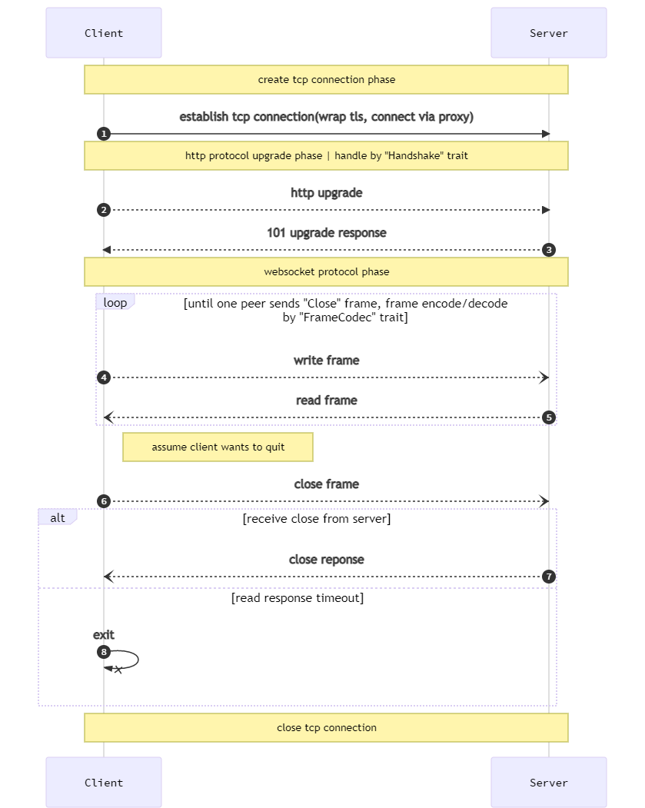

## connection flow

<details>
<summary>expand to show flow code</summary>

```text
sequenceDiagram
    autonumber
    participant C as Client
    participant S as Server
    Note over C,S: create tcp connection phase 
    C->>S: establish tcp connection(wrap tls, connect via proxy)
    Note over C,S: http protocol upgrade phase | handle by "Handshake" trait
    C-->>S: http upgrade
    S-->>C: 101 upgrade response
    Note over C,S: websocket protocol phase
    loop until one peer sends "Close" frame, frame encode/decode by "FrameCodec" trait
        C--)S: write frame
        S--)C: read frame
    end
    Note right of C: assume client wants to quit
    C--)S: close frame
    alt  receive close from server
        S--)C: close reponse
    else read response timeout
        C-xC: exit
    end
    Note over C,S: close tcp connection
  
```
</details>

